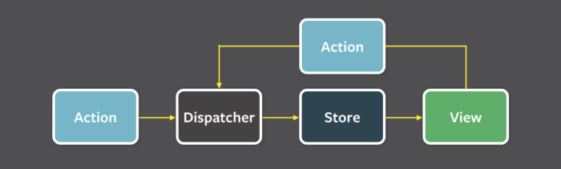
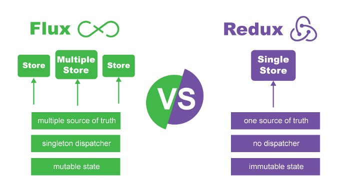
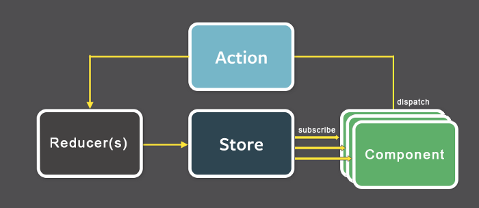
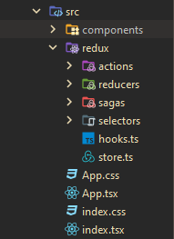
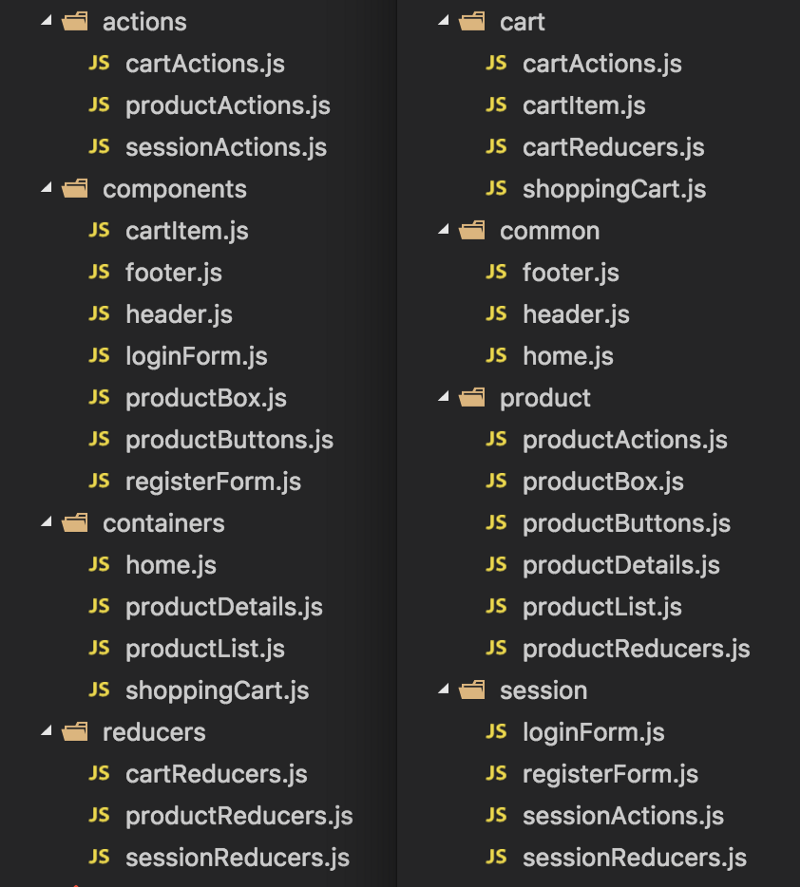

# Redux Showcase

- [Redux Showcase](#redux-showcase)
  - [Must Know](#must-know)
    - [What Is Redux?](#what-is-redux)
    - [What about Flux?](#what-about-flux)
    - [And what's the difference?](#and-whats-the-difference)
    - [Three Fundamental Principles](#three-fundamental-principles)
      - [Single Source of Truth](#single-source-of-truth)
      - [State is read-only](#state-is-read-only)
      - [Changes are made with pure functions](#changes-are-made-with-pure-functions)
  - [Design Patterns](#design-patterns)
    - [Classic](#classic)
      - [With Redux Saga](#with-redux-saga)
      - [Custom Middlewares](#custom-middlewares)
    - [Ducks Pattern](#ducks-pattern)
      - [Redux Toolkit](#redux-toolkit)
  - [Further Reference](#further-reference)

## Must Know

### What Is Redux?

Redux is a pattern and library for **managing and updating application state**, using events called "*actions*". It serves as a **centralized** store for state that needs to be used across your entire application, with rules ensuring that the state can only be updated in a *predictable fashion*.

### What about Flux?

>  **Unidirectional data flow** is one of the integral concepts of Flux: All data must flow in only one direction, and is a significant part of what keeps everything so predictable.

* **Actions**: Representations of the ways users can interact with the application.

* **Dispatcher**: Receives an action and forwards it to each of the application's store.

* **Stores**: Structures which hold the application's state, as well as the logic around how to update that state.

* **Views**: What the user sees and interacts with. They are the interface for displaying the data from the stores, as well as for sending actions back to the stores through the dispatcher.

### And what's the difference?

Redux data flow looks like this:

* **No Dispatcher**: Redux has a single store, so there is only a single destination to broadcast new actions to, thus eliminating the need for a dispatcher.

* **A Single, Less Convoluted Store**: All application's state is located within a centralized store which acts as the application's single source of truth. Additionally, the store's responsibilities have been reduced, it is now only responsible for containing the state, and is no longer in charge of determining how to adjust its state in response to actions. That logic has been delegated to reducers.

* **Reducers**: Pure functions which accept the current state and a given action as arguments, and which output either the unmodified state or a new, edited copy of the state. Redux considers state to be immutable.

### Three Fundamental Principles

1. Single Source of Truth
2. State is read-only
3. Changes are made with pure functions

#### Single Source of Truth

> The global state of your application is stored in an object tree within a single store.

This makes it easy to create universal apps, as the state from your server can be serialized and hydrated into the client with no extra coding effort.

#### State is read-only

> The only way to change the state is to emit an action, an object describing what happened.

This ensures that neither the views nor the network callbacks will ever write directly to the state. Instead, they express an intent to transform the state. Because all changes are centralized and happen ony by one in a strict order, there are no subtle race conditions to watch out for.

As actions are just plain objects, they can be logged, serialized, stored, and later replayed for debugging or testing purposes.

#### Changes are made with pure functions

> To specify how the state tree is transformed by actions, you write pure reducers.

Reducers are just pure functions that take the previous state and an action, and return the next state (a new one, instead of mutating the previous state). Because reducers are just functions, you can control the order in which they are called, pass additional data, or even make reusable reducers for common tasks such as pagination.

## Design Patterns

> All examples are based on React+Typescript, see [Quick Start Reference](https://react-redux.js.org/tutorials/typescript-quick-start).

Please refer to [Redux Style Guide](https://redux.js.org/style-guide/style-guide) on principles behind these implementations.

### Classic

Common disadvantages:

* **folder-by-type** or **function-first folder** structure
* Strongly coupled with libraries -> need to ramp up in every project
* Very opinionated
* Hard to maintain, scale and understand as it grows

#### With Redux Saga

> https://redux-saga.js.org/

See [Counter example](classic/sagas-app)

Advantages:
* Composition-focused
* Complex asynchronous flow (e.g., concurrency, racing, cancellation, debounce, etc)

Disadvantages:
* Need to ramp up with *generators*
* Effect creators learning curve

#### Custom Middlewares

Advantages:
* Light-weight implementation for simple promises
* Dependency-free implementation lets you be productive right if you know JS.
* Can be easily adapted to own needs

Disadvantages:
* Complex asynchronous behavior is hard to test and debug

### Ducks Pattern

> Based on [Ducks: Redux Reducer Bundles proposal](https://github.com/erikras/ducks-modular-redux) and [re-ducks](https://github.com/alexnm/re-ducks)

Advantages:
* **folder-by-feature** or **feature-first folder** approach
* Scalable & easy to maintain
* Easy to understand, one feature at a time

#### Redux Toolkit

See [Counter example](./ducks/toolkit)

## Further Reference

* [Flux notes](https://github.com/herrera-ignacio/architect-handbook#flux--redux)
* [Redux notes](https://github.com/herrera-ignacio/architect-handbook#technology-specifics)
